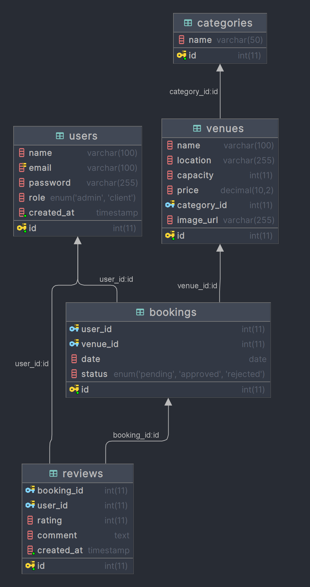

# 🏛️ Venue Booking Management System

An admin-controlled venue booking system built with PHP and MySQL. It allows users to book venues, while admins can manage bookings, users, and venues with full control.

---

## 🌐 Features

### 👥 User Roles
- **Client** (default): Can request venue bookings.
- **Admin**: Can manage all aspects of the app.

### 🏠 Venues
- View available venues with details like name, location, capacity, price, and image.
- Venues are categorized by type (e.g., Wedding Hall, Conference Room).

### 📅 Bookings
- Users can:
  - Select a venue, date, and submit a booking request.
- Admins can:
  - View, approve, reject, or revert booking requests.
  - See all booking information at a glance.
  - Filter bookings by user, venue, and status (pending, approved, rejected).
  - Prevent double-booking on the same venue and day.

### ✍️ Reviews
- Only users with **approved past bookings** can submit a review (1-5 stars with comment).
- Venues display average ratings based on reviews.

### 🔐 Authentication
- Users can register and log in securely.
- Admin authentication is required to access the dashboard.

---

## 🧰 Technologies Used

- **Backend:** PHP (OOP, MVC-inspired structure)
- **Frontend:** HTML, Bootstrap 5
- **Database:** MySQL
- **Session Management:** PHP native sessions

---

## 🗃️ Database Schema

### Key Tables

- `users`: stores user details and roles.
- `categories`: types of venues (e.g., weddings, conferences).
- `venues`: venue details with reference to categories.
- `bookings`: stores booking requests with status.
- `reviews`: holds ratings/comments linked to bookings.

---

## 🚀 Getting Started

### ✅ Prerequisites
- PHP >= 7.4
- MySQL
- Apache or Nginx
- Composer (optional)

### ⚙️ Setup Instructions

1. Clone the repository

   git clone https://github.com/your-username/your-repo.git
   cd your-repo

2. Import the database

   mysql -u root -p your_database < database/schema.sql

3. Configure your server
   - Place the project in your server root (htdocs, www, or Nginx equivalent).
   - Update database credentials in config/database.php if needed.

4. Visit the app
   - Go to: http://localhost/your-app

---

## 🔧 Admin Panel

- Login as Admin: role = admin in users table.
- Manage:
  - All bookings
  - All venues
  - All users
  - Add/edit/delete records
  - Filter bookings easily using dropdowns

---

## 🖼️ Favicon

Make sure to include the favicon by placing the following tag in your HTML <head>:

<link rel="icon" href="/assets/images/favicon.png" type="image/png">

---

## ✍️ Future Improvements
- Email notifications for booking status changes
- User dashboard to view personal bookings
- AJAX-based filtering without page reloads
- Calendar view for venue availability

---

## 📄 License

This project is open-source and free to use.